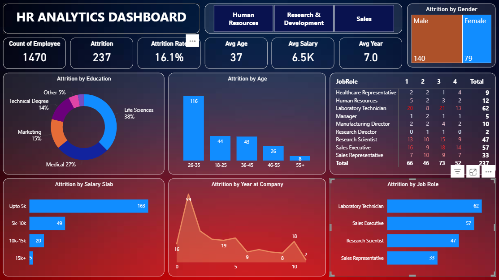

This project presents an interactive **HR Analytics Dashboard** built in **Power BI** to analyze employee attrition and workforce trends.
---
## 📸 Dashboard Preview

## 🔍 Project Overview

The dashboard provides insights into:

* Total Employees & Attrition Rate
* Average Age, Salary, and Years at Company
* Attrition by Education Background
* Attrition by Age Group and Gender
* Attrition by Salary Slab
* Attrition by Job Role
* Department-wise analysis (HR, R&D, Sales)
---

## 🛠 Tools Used

* Power BI Desktop
* Power Query for data cleaning
* DAX for calculated measures
* Star-schema style data modeling
---

## 🎯 Objective

To convert raw HR data into actionable insights that help organizations:

* Reduce employee turnover
* Identify high-risk roles
* Improve retention strategies
* Support data-driven HR decisions
---

## 🧠 Skills Demonstrated

* Data Modeling & Relationships
* DAX Measures & KPI Creation
* HR Analytics & Attrition Analysis
* Dashboard Design & Visual Storytelling
* Business Insight Generation
---

## 📊 Dataset

Sample HR dataset used for educational and portfolio purposes.

---

⭐ If you found this project useful, feel free to star the repository or connect with me.

🚀 Always learning and building — open to feedback and collaboration.

---

